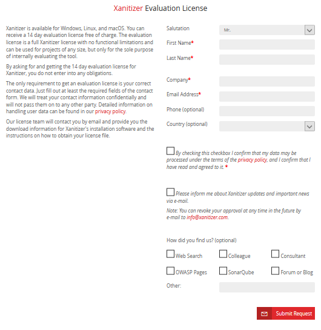
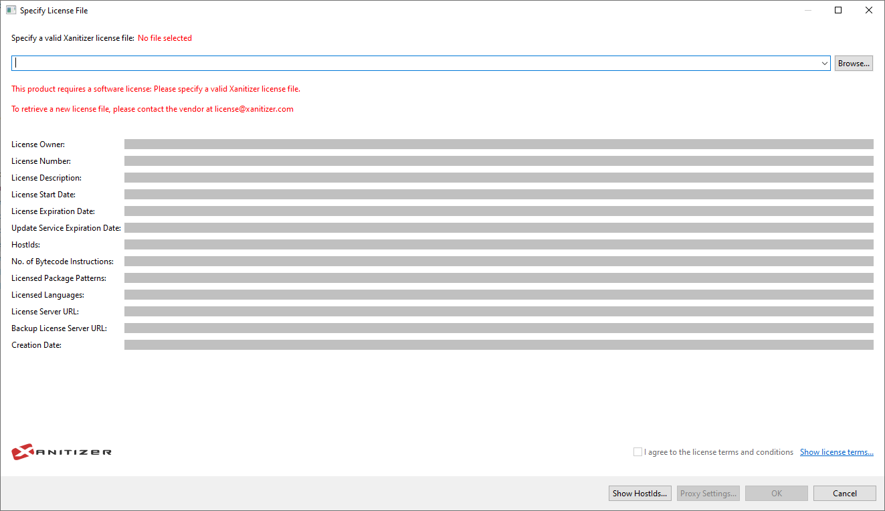
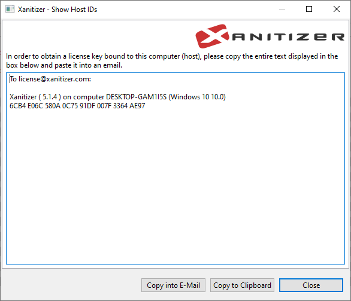
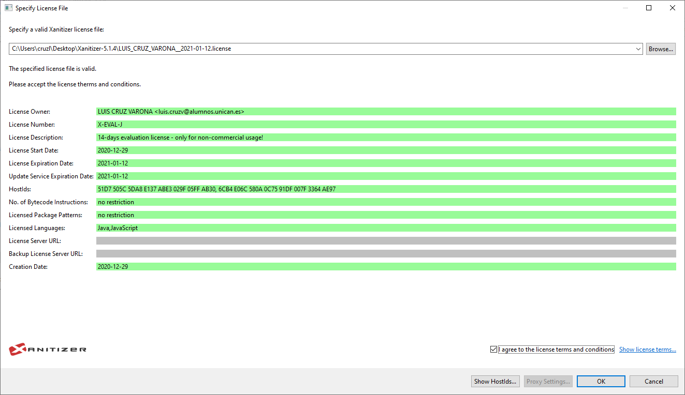

### Requisitos de asistencia

#### Aviso previo al taller

El tiempo necesario para la obtención de la licencia varía según el tiempo de respuesta del personal de Xanitizer. En nuestro caso, nos ha llevado un mínimo de varias horas para completar el proceso de activación. Además, el personal de Xanitizer llega incluso a pedir información sobre el uso que se va a dar al programa así como otros datos sobre el usuario que lo pide. Es posible que puedas solo mandar los datos necesarios para la activación de la licencia sin tener que responder a sus preguntas sobre tu uso, pero no hemos corroborado que eso sea posible.

Por lo tanto, para asistir a este taller **NO RECOMENDAMOS** obtener la licencia (de 14 días) y descargar Xanitizer si su uso va a ser exclusivo para este taller. Se recomienda, sin embargo, tener a mano el documento del ejemplo guiado del taller, que podrá ser de ayuda durante el mismo. El ejemplo a seguir en el taller viene distribuido con la herramienta, y una versión del ejemplo completada se encuentra disponible en el repositorio de este taller.

Si aún así deseas obtener y probar la herramienta, en la siguiente sección se detallan los pasos.

#### Obtención de Xanitizer

##### Petición de la prueba

Para obtener Xanitizer el primer paso necesario será pedir una prueba gratuita. Para ello, es necesario ir a la siguiente página https://www.xanitizer.com/xanitizer-free-trial/ y rellenar el formulario que ahí se encuentra:

Una vez hecho esto, recibirás en la dirección de correo que has especificado en el formulario dos correos, uno automatizado y otro enviado por el personal de Xanitizer en el que se detallan los siguientes pasos de instalación de la herramienta y se piden unos **“HostIds”** que te proporciona la herramienta para generar la licencia de prueba.

##### Descarga de Xanitizer y obtención de la licencia

Una vez recibidos ambos correos, puedes descargar Xanitizer de la siguiente página: https://www.xanitizer.com/xanitizer-latest-release/. Para instalar la herramienta sólo será necesario descomprimirla en cualquier directorio.

Una vez descomprimida, se puede iniciar desde el ejecutable **“Xanitizer.exe”**. La primera vez que se inicie la aplicación aparecerá la siguiente ventana, pidiendo el archivo de la licencia:

Para obtener dicha licencia deberás pulsar el botón **“Show HostIds”**, tras lo que te aparecerá una nueva ventana, con un cuadro de texto:

Deberás copiar el texto dentro del cuadro y enviarlo a Xanitizer como respuesta al email del personal (el email que contenía los pasos para instalar la herramienta). Alternativamente, puedes enviarlo a la dirección de email que aparece en la ventana con los HostIds ([license@xanitizer.com](mailto:license@xanitizer.com)). 

##### Importación de la licencia

Una vez hecho esto, recibirás un correo de confirmación por parte del personal de Xanitizer, con el archivo de licencia adjunto (por nuestra experiencia personal, este proceso se puede completar en un día, sin embargo, este puede no ser siempre el caso).

Descarga el archivo de licencia y ejecuta de nuevo Xanitizer. Esta vez, importa el archivo de licencia pulsando el botón **“Browse”**. Si todo ha ido bien, se te rellenarán todos los campos necesarios, apareciendo en verde, y (una vez aceptados los términos de Xanitizer) se te desbloqueará el botón de “OK”, como en la imagen a continuación:

##### Obtención del ejemplo del taller

El ejemplo que se utilizará en el taller viene distribuido por defecto con Xanitizer, se trata del proyecto **“WebGoat”** disponible en la carpeta **“examples”**, cabe destacar que este proyecto vendrá sin las modificaciones que se realizarán durante el taller. Si deseas obtener la versión completada del ejemplo, ésta se encuentra disponible en el github del taller.